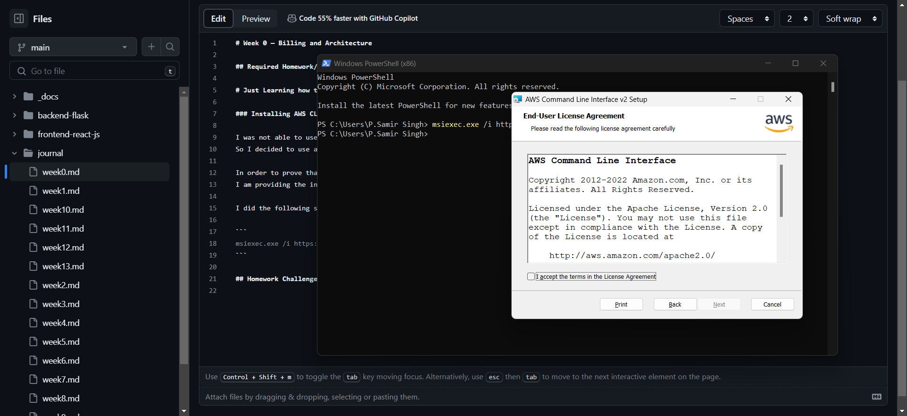
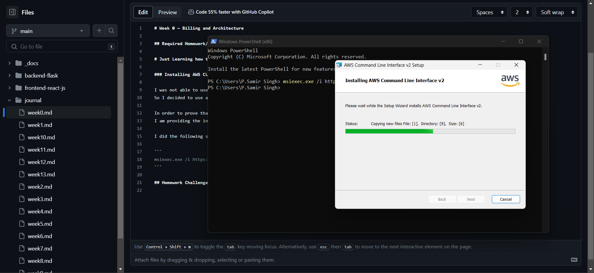

# Week 0 — Billing and Architecture

## Required Homework/Tasks

# Just Learning how to use it from the tut

### Installing AWS CLI

I was not able to use Gitpod or Github codespaces due to browser issues.
So I decided to use a local environment.

In order to prove that I am able to use AWS CLI.
I am providing the instructions I used for my configuration of my local machine on windows.

I did the following steps to install AWS CLI.


I install the AWS CLI via this command in **Command Prompt**:
```
msiexec.exe /i https://awscli.amazonaws.com/AWSCLIV2.msi
```

The command for aws works after closing the command prompt and then reopening it


## Homework Challenges
